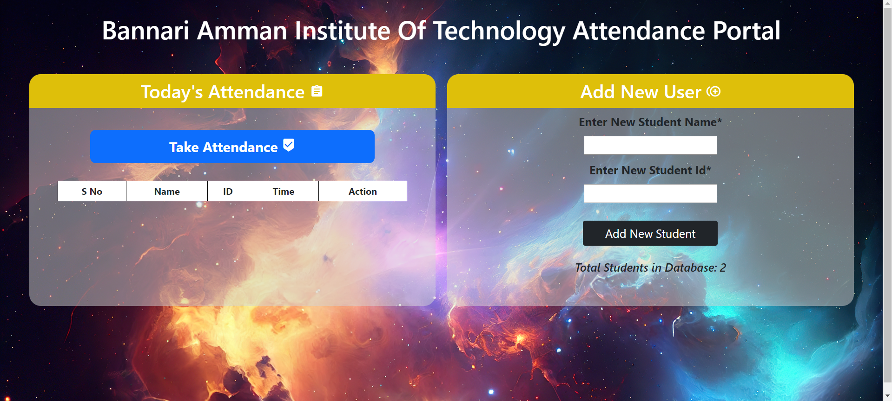
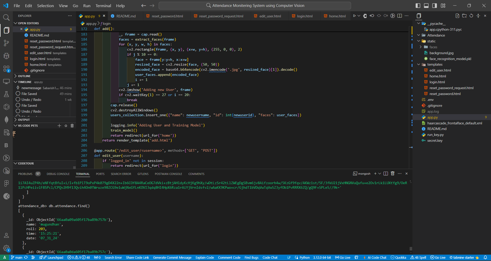
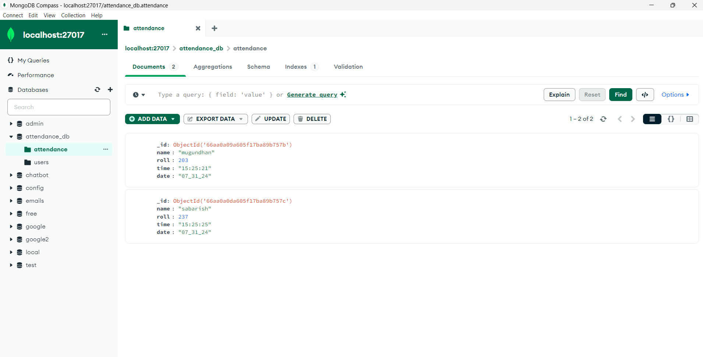

# Attendance Monitoring System with Facial Recognitions

## Overview
This project is an attendance monitoring system that uses facial recognition technology to mark and track attendance. It utilizes OpenCV for face detection, a machine learning model for face recognition, and Flask for the web interface.

## Demo

[Watch the demo video](https://drive.google.com/file/d/1Gqt7hocnJyS9D3U5s7ufA17NXbxndkKI/view?usp=sharing)


## Features
- Real-time facial recognition
- Voice feedback for successful attendance
- Add and manage users
- Generate and view attendance logs
- Secure and scalable design






](image-1.png)


## Requirements
- Python 3.x
- OpenCV
- Flask
- scikit-learn
- pandas
- joblib
- gTTS
- pygame
- numpy
- smtplib
- cryptography
- pymongo

## Installation

1. **Clone the Repository**
   ```bash
   git clone https://github.com/yourusername/attendance-monitoring-system.git
   cd attendance-monitoring-system
   ```

2. **Create a Virtual Environment**
   ```bash
   python -m venv venv
   source venv/bin/activate  # On Windows use `venv\Scripts\activate`
   ```

3. **Install Dependencies**
   ```bash
   pip install -r requirements.txt
   ```

4. **Download Haar Cascade File**
   Download `haarcascade_frontalface_default.xml` from the [OpenCV GitHub repository](https://github.com/opencv/opencv/tree/master/data/haarcascades) and place it in the project directory.

## Usage

1. **Start the Flask Server**
   ```bash
   python app.py
   ```

2. **Access the Web Interface**
   Open your web browser and navigate to `http://127.0.0.1:5000/`.

3. **Add a New User**
   - Go to the `/add` route.
   - Provide the new username and roll number.
   - The system will prompt you to capture images for the new user.

4. **Start Attendance**
   - Go to the `/start` route to start the attendance process.
   - The system will detect faces and mark attendance.

## File Structure

- `app.py`: Main Flask application.
- `haarcascade_frontalface_default.xml`: Haar cascade file for face detection.
- `static/`: Directory for static files, including user images and the machine learning model.
- `templates/`: Directory for HTML templates.
- `requirements.txt`: List of dependencies.

## Functions

### `totalreg()`
Returns the number of registered users.

### `extract_faces(img)`
Extracts faces from an image using OpenCV.

### `identify_face(facearray)`
Identifies a face using the pre-trained machine learning model.

### `train_model()`
Trains the face recognition model on available user images.

### `extract_attendance()`
Extracts attendance data from today's records.

### `add_attendance(name)`
Adds attendance for a recognized user.

### `play_voice_message(message)`
Plays a voice message using gTTS and pygame.

### `send_email(subject, body, to_email)`
Sends an email with the specified subject and body to the specified email address.

### `getallusers()`
Retrieves all registered users.

## Configuration

- **Database Configuration**: Adjust database paths as needed in the code.
- **Voice Feedback**: Modify the `play_voice_message` function for different messages or languages.
- **Email Configuration**: Update the `send_email` function with appropriate SMTP settings and login credentials.

## Troubleshooting

- **Model Not Found**: Ensure `face_recognition_model.pkl` exists in the `static` directory.
- **No Faces Detected**: Check the quality of input images and lighting conditions.

## License
This project is licensed under the MIT License - see the [LICENSE](LICENSE) file for details.

## Acknowledgments
- [OpenCV](https://opencv.org/)
- [Flask](https://flask.palletsprojects.com/)
- [scikit-learn](https://scikit-learn.org/)
- [gTTS](https://pypi.org/project/gTTS/)
- [pygame](https://www.pygame.org/)
- [MongoDB](https://www.mongodb.com/)

